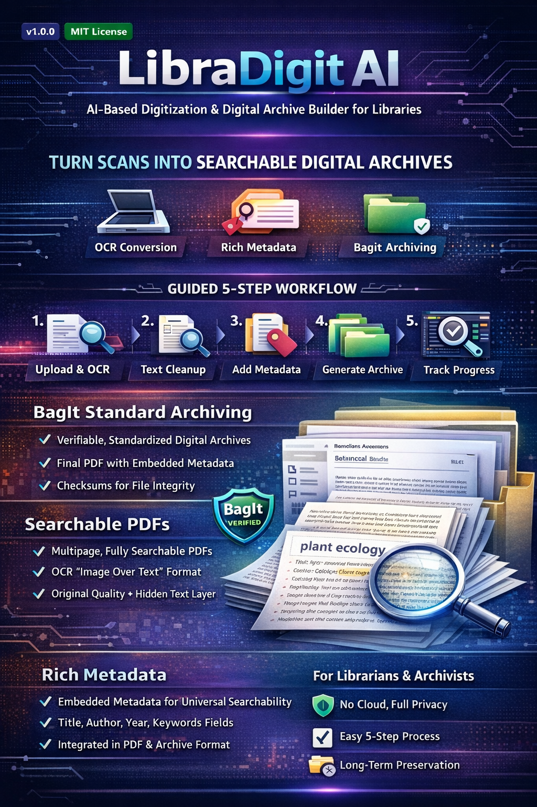

# LibraDigit AI

**Smart Digitization for Libraries • From Scans to Searchable Digital Archives**

A production-grade, local-first application that converts physical books, scanned PDFs, and image collections into searchable, metadata-rich digital archives using a guided 5-step workflow.

<p align="center">
  
</p>

<p align="center">
  <a href="mailto:tkarthikeyan@gmail.com"></a>
  
  
  
  
</p>

---

## 🏛️ Sovereign 5-Step Digitization Pipeline

```
┌──────────┐     ┌──────────┐     ┌───────────┐     ┌────────────┐     ┌─────────────┐
│ 1 Upload │ ──▶ │  2 OCR   │ ──▶ │ 3 Cleanup │ ──▶ │ 4 Metadata │ ──▶ │  5 Archive  │
└──────────┘     └──────────┘     └───────────┘     └────────────┘     └─────────────┘
                                                                              │
                                                                              ▼
                                      /Archive ──▶ - Subject ──▶ - Year ──▶ [OFFLINE]
```

## 🎯 Overview

LibraDigit AI is built for librarians, archivists, researchers, and digitization teams to:

- 🔍 **OCR Accuracy Control**: Optical character recognition with word-by-word confidence scoring and layout analysis.
- 📄 **Searchable & Selectable PDFs**: Automatically generates dual-layer sandwich PDFs with pixel-aligned selectable text.
- 🏷️ **Rich Dublin Core Metadata**: Embedded XMP tags, auto-suggested Title, Author, Year, Subject, and Keywords.
- 🗄️ **Auto Archive Structure**: ISO BagIt (RFC 8493) preservation packaging with SHA-256 and MD5 checksum manifests.
- 🔒 **100% Data Sovereignty**: All processing runs locally with zero telemetry and complete privacy (`#LibraryDigitization #OCR #DataPrivacy`).

## 🚀 Key Features

### 🤖 Advanced OCR & AI Analysis
- **Scanned PDF OCR with Handwritten Support**: Automatically detects PDFs with embedded images and applies intelligent OCR. Switches to handwritten mode (LSTM) when handwriting is detected on any page.
- **Intelligent Layout Understanding**: Automatically detects page structure including headers, footers, stamps, and signatures.
- **Table & Form Extraction**: Identifies and extracts structured data from tables and form fields with checkbox detection.
- **Auto-Orientation Correction**: Automatically detects and corrects page rotation (0°, 90°, 180°, 270°).
- **Handwritten Text Recognition**: Specialized LSTM neural network for improved handwriting accuracy (75-92%).
- **Enhanced Preprocessing**: CLAHE enhancement, adaptive thresholding, and advanced denoising for better accuracy.
- **Handwritten to PDF**: Convert handwritten notes directly to professionally formatted, searchable PDF documents.

### 📖 Converted E-Books Repository & Reader
- **Comprehensive E-Book Registry**: Responsive table view showcasing all digitized documents with title, author, year, subject classification, preservation status, file size, and word count.
- **High-Fidelity Document Reader**: Click any row or document to view and read with high-DPI canvas rendering, zoom controls, page flipping, rotation, and fullscreen mode.
- **Dual-View Transcription**: Seamlessly toggle between rendered PDF, extracted OCR text, and archival preservation dossiers (BagIt & XMP metadata).
- **Direct Export & Downloads**: One-click downloads for auto-generated searchable sandwich PDFs and direct browser tab previews.

### 🔍 Extensive Search Facility
- **Full-Text Search (FTS5)**: Powered by SQLite's FTS5, search instantly through thousands of archived documents.
- **Content-Aware Snippets**: Search results show exactly where terms appear with keyword highlighting.
- **Universal Metadata Search**: Find documents by Title, Author, Keywords, or any content within the text.

### 📊 Analytics & Statistics
- **Workflow Visualization**: Track project distribution across Upload, OCR, Cleanup, Metadata, and Archived stages.
- **Storage Metrics**: Real-time tracking of disk space usage by your digital collection.
- **Activity Trends**: Weekly activity charts showing your digitization team's productivity.
- **Top Subjects**: Bar charts showcasing the most represented subjects in your archive.

### 🔒 Secure & Private
- **Secure Offline Auth**: Implements bcryptjs hashing for local authentication.
- **First-Run Setup**: Guided password setup on the first launch.
- **Privacy-First**: Zero cloud dependency; all data, hashes, and files stay exclusively on your local machine.

### 📱 Responsive & Modern UI
- **Responsive Design**: Optimized for everything from desktop monitors to mobile devices.
- **Multi-tab Synchronization**: Log out or delete a project in one browser tab, and all other tabs will instantly synchronize.
- **Premium Aesthetics**: High-end dark theme with smooth gradients and micro-animations.

### 📦 Archival Standards
- **BagIt Packaging**: Implements the international BagIt standard for robust, verifiable data packages.
- **XMP Metadata Embedding**: Metadata (Title, Author, etc.) is embedded directly into the PDF binary, traveling with the file even when shared.
- **MD5 Manifests**: Automatic integrity checks to ensure files remain uncorrupted over decades.

## 📋 Prerequisites

### Required Software

1. **Node.js** (v18 or higher)
   - Download: https://nodejs.org/

2. **Python** (v3.8 or higher)
   - Download: https://www.python.org/downloads/

3. **Tesseract OCR** (for OCR functionality)
   - **Windows**: Download installer from https://github.com/UB-Mannheim/tesseract/wiki
   - **macOS**: `brew install tesseract`
   - **Linux**: `sudo apt-get install tesseract-ocr`

### Additional Dependencies for Advanced Features

4. **OpenCV** (for advanced image processing)
   - Installed automatically via `requirements.txt`
   - Required for: Advanced OCR, handwritten text recognition, table detection

5. **ReportLab** (for PDF generation)
   - Installed automatically via `requirements.txt`
   - Required for: Handwritten to PDF conversion

## 🛠️ Installation

### 1. Clone or Download the Project

```bash
cd "LibraDigit AI"
```

### 2. Install Dependencies

```bash
# Install frontend packages
npm install

# Install backend packages (includes OpenCV, NumPy, ReportLab)
cd backend
pip install -r requirements.txt
cd ..
```

## 🎮 Running the Application

### ⚡ Quick Launch (Windows 1-Click)

Double-click `run-app.bat` or run in your terminal:

```cmd
:: Standard 1-click launch (Backend + Frontend + Browser)
run-app.bat

:: Launch in Electron desktop app mode
run-app.bat electron

:: Stop all running services (kill background ports 5001 and 3000)
run-app.bat stop
```

This automated launcher will:
- Detect your Python runtime (checking root `.venv`, `backend/.venv`, or system Python)
- Verify Node.js and npm availability
- Automatically inspect and install missing `node_modules` via `npm install`
- Check if port 5001 is already running to prevent duplicate instances or port conflicts
- Start the Flask backend server on `http://localhost:5001`
- Launch the Vite frontend server on `http://localhost:3000`
- Open your default browser smoothly once the servers are ready

### Manual Development Mode

Alternatively, run the backend and frontend services separately:

```bash
# Terminal 1 - Backend Server (Flask API)
npm run dev:backend

# Terminal 2 - Frontend Web App (Vite)
npm run dev
```
### Desktop Electron Mode

To run or bundle the desktop client:

```bash
# Run Electron desktop window in development mode
npm run dev:electron

# Build Windows installer (.exe) via electron-builder
npm run dist

# Package into directory without building installer
npm run pack
```

### Dedicated Backend Launch

To run only the backend server on port 5001:

```cmd
run-backend.bat
```

### Linting & CI

```bash
npm run lint                      # ESLint (frontend + Electron)
cd backend && ruff check .        # Python
```

CI (`.github/workflows/ci.yml`) runs lint, the backend tests, the frontend build and a
Windows packaging smoke test on every pull request. See [docs/RELEASING.md](docs/RELEASING.md)
for building and signing the Windows installer.
### Running the Tests

```bash
cd backend
pip install -r requirements-dev.txt
python -m pytest tests -q      # OCR workflow tests are skipped if Tesseract is absent
```

**Desktop end-to-end test** (`e2e/desktop.spec.js`): drives the packaged Electron app through
first-run setup, upload, OCR, review, metadata, PDF/A archive, search and shutdown. CI runs it
on Windows for every pull request and before every release.

```bash
cd backend && pyinstaller --noconfirm server.spec && cd ..   # backend executable
ELECTRON_BUILD=true npm run build
npx electron-builder --dir --publish never                   # unpacked app in release/
npx playwright test                                          # Linux without a display: xvfb-run -a npx playwright test
```

### Backend Configuration

The backend reads optional environment variables (see `backend/app/config.py`):

| Variable | Default | Purpose |
|---|---|---|
| `LIBRADIGIT_HOST` / `LIBRADIGIT_PORT` | `127.0.0.1` / `5001` | Bind address. Keep it on localhost. |
| `LIBRADIGIT_ALLOWED_ORIGINS` | `http://localhost:3000,...` | Browser origins allowed to call the API (dev mode). |
| `LIBRADIGIT_API_TOKEN` | unset | Shared secret required in `X-LibraDigit-Token`. The Electron app generates one per launch automatically. |
| `LIBRADIGIT_DEBUG` | `false` | Flask debug mode. Never enable outside local development. |
| `LIBRADIGIT_MAX_UPLOAD_MB` | `200` | Maximum request size. |
| `LIBRADIGIT_ENABLE_TRANSLATION` | `true` | Set `false` to stop the Translate feature sending text to Google. |

## 📚 Documentation

Detailed technical guides, architectural diagrams, and feature walkthroughs have been organized in the [`docs/`](docs) directory:

- [System Architecture](docs/ARCHITECTURE_DIAGRAM.md)
- [Backend Guide](docs/BACKEND_GUIDE.md)
- [Advanced OCR Documentation](docs/ADVANCED_OCR_DOCUMENTATION.md)
- [Handwritten Text Processing Guide](docs/HANDWRITTEN_TEXT_PROCESSING_GUIDE.md)
- [Export System Documentation](docs/EXPORT_SYSTEM_DOCUMENTATION.md)
- [Tesseract Setup Guide](docs/TESSERACT_SETUP.md)


### Creating Your First Project

1. **Launch & Setup**: On first run, create your master password.
2. **Upload Document**: Drag and drop a PDF or image file (PDF, PNG, JPEG, TIFF). Scanned PDFs are automatically detected.
3. **Choose OCR Method**:
   - **Standard OCR**: Fast text extraction for printed documents and scanned PDFs
   - **Advanced OCR**: AI-powered analysis with table detection, form recognition, and layout understanding (images only)
   - **Handwritten to PDF**: Convert handwritten notes to formatted, searchable PDFs (images only)
4. **Run OCR**: Tesseract converts image text into a searchable layer. For scanned PDFs, pages are automatically rendered as images at 300 DPI.
5. **Clean Text**: Use the side-by-side rich text editor to correct OCR typos.
6. **Add Metadata**: Add descriptive details (Subject, Year, Author).
7. **Generate Archive**: The system builds the BagIt package and embeds your metadata.

### 🤖 Using Advanced OCR

For documents with complex layouts:

1. Upload your document (image format recommended)
2. Toggle **"Advanced OCR Analysis"** switch
3. Click **"Run Advanced OCR"**
4. View comprehensive results including:
   - Detected tables and their contents
   - Form fields and checkboxes (with fill status)
   - Page orientation corrections
   - Headers, footers, stamps, and signatures
   - Enhanced text extraction with layout preservation

### ✍️ Converting Handwritten Notes to PDF

For handwritten documents:

1. Upload a clear image of handwritten notes (300+ DPI recommended)
2. Select the appropriate language
3. Click **"Convert Handwritten to PDF"**
4. Receive a professionally formatted PDF with:
   - Extracted and structured text
   - Detected headings and paragraphs
   - Bullet points and lists
   - Diagrams and technical content
   - Complete metadata

### 📚 Installation Guide
For a detailed step-by-step visual guide on installing the Electron desktop application, please refer to:
`public/install_guide.html` (included in the distribution package).

This guide covers:
- System Requirements (Tesseract OCR)
- SmartScreen Security Bypass (for internal tools)
- First-time Account Setup

### Searching the Archive
Click **"Archive Search"** in the sidebar to perform lightning-fast keyword searches across your entire processed collection.

### Archive Structure (BagIt Standard)
Documents are organized using a standard preservation hierarchy:

```
Archive/
  └── Subject/
      └── Year/
          └── Author_Year_Title/
              ├── data/
              │   └── Author_Year_Title.pdf   (PDF/A-2b with XMP Dublin Core metadata)
              ├── dublin-core.xml             (oai_dc record)
              ├── bagit.txt                   (BagIt declaration)
              ├── bag-info.txt                (Package metadata incl. Archival-Format)
              ├── manifest-md5.txt            (MD5 checksums)
              ├── manifest-sha256.txt         (SHA-256 checksums)
              └── tagmanifest-sha256.txt      (Checksums of the metadata files)
```

**PDF/A-2b.** Every PDF LibraDigit generates (OCR output, image conversions, placeholders)
is written as PDF/A-2b and validated with [veraPDF](https://verapdf.org) in the test suite.
Imported born-digital PDFs are archived as standard PDFs with the same metadata, because they
can break PDF/A rules that cannot be checked without a full validator. The Archive page and
`bag-info.txt` (`Archival-Format`) show which format each document received.

**Dublin Core export.** Download a single record from the Archive page, or the whole catalogue
from the Dashboard (**Export Catalogue**: CSV with `dc.*` columns for DSpace / Omeka / Excel, or
oai_dc XML). API: `GET /api/projects/<id>/dublin-core`, `GET /api/export/metadata?format=csv|xml&scope=archived|all`.

### Background processing
OCR runs as background jobs with page-level progress and cancellation:
`POST /api/jobs {kind: ocr|advanced_ocr|handwritten_to_pdf, project_id, params}` returns a job
to poll at `GET /api/jobs/<id>`; `POST /api/jobs/<id>/cancel` stops it between pages. Jobs
survive navigation; after a restart, queued jobs resume and interrupted ones are marked failed.

## 🔧 Technology Stack

### Frontend & UI
- **React 18** (Vite)
- **Lucide React** (Icons)
- **Recharts** (Analytics)
- **Bcryptjs** (Local Auth)
- **Axios** (API)

### Desktop
- **Electron** (Cross-platform desktop engine)

### Backend & Engine
- **Flask** (Python API)
- **SQLite 3** (Database & FTS5 Search Engine)
- **Tesseract OCR** (Text Extraction with LSTM neural networks)
- **PyMuPDF** (PDF text extraction, rendering at 300 DPI, merging and metadata)
- **OpenCV** (Advanced image processing & computer vision)
- **NumPy** (Numerical operations for image analysis)
- **ReportLab** (PDF generation)
- **pikepdf** (PDF/A-2b conversion and XMP metadata)

## 🎨 Project Structure

```
LibraDigitAI/
├── backend/
│   ├── server.py               # Entrypoint (python server.py / PyInstaller)
│   ├── app/
│   │   ├── __init__.py         # create_app() factory, CORS, error handling
│   │   ├── config.py           # Environment-driven settings
│   │   ├── db.py               # SQLite connection (WAL), schema, app_config
│   │   ├── security.py         # API guard, upload/path safety, validation
│   │   ├── search_index.py     # FTS5 index + safe query building
│   │   ├── jobs.py             # Background job queue (progress, cancel, recovery)
│   │   ├── migrations.py       # Moves pre-1.3 desktop data into the user profile
│   │   ├── routes/             # Blueprints: projects, ocr, documents, batch, system
│   │   ├── services/           # OCR pipeline, archive (BagIt), projects, text files
│   │   └── processors/         # Advanced OCR, handwriting, GLM-OCR, metadata, batch
│   ├── tests/                  # pytest suite (security + end-to-end workflow)
│   └── scripts/                # Maintenance utilities (DB check/migrate, manual API test)
├── electron/                   # Desktop shell (spawns backend, injects API token)
├── src/
│   ├── App.jsx                 # Routes (each page lazy-loaded)
│   ├── components/             # Shared UI
│   ├── pages/                  # One file per screen
│   ├── context/                # Project + toast state
│   └── config.js               # API base URL
├── public/                     # Files served as-is with the web build
├── assets/marketing/           # Posters, brochures (not shipped in builds)
├── docs/                       # Guides; docs/history holds past change notes
├── Archive/, uploads/          # Runtime data (git-ignored)
└── SECURITY_QA_AUDIT.md        # Latest audit findings and status
```

## 📚 Additional Documentation & References

- **[Advanced OCR Documentation](docs/ADVANCED_OCR_DOCUMENTATION.md)** - Complete guide to AI layout analysis and table extraction
- **[Handwritten to PDF Guide](docs/HANDWRITTEN_TO_PDF_DOCUMENTATION.md)** - Handwritten text conversion and styling guide
- **[Quick Start Guide](docs/QUICK_START_ADVANCED_OCR.md)** - Get started with advanced OCR features quickly
- **[Architecture & Flowcharts](docs/ARCHITECTURE_DIAGRAM.md)** - Deep dive into system components and data flows
- **[Scanned PDF OCR Guide](docs/SCANNED_PDF_OCR_DOCUMENTATION.md)** - High-res rendering and OCR workflow
- **[Export System Reference](docs/EXPORT_SYSTEM_DOCUMENTATION.md)** - BagIt packages, manifests, and XMP embedding
- **[Full Changelog](docs/CHANGELOG.md)** - Version history and feature breakdown
- **[JSON Serialization Fix](docs/history/JSON_SERIALIZATION_FIX.md)** - Technical troubleshooting guide

---

## 👨‍💻 Creator & Maintainer

**Created by**: Karthikeyan T  
**Email**: [tkarthikeyan@gmail.com](mailto:tkarthikeyan@gmail.com)  
**GitHub**: [github.com/carthworks](https://github.com/carthworks)  
**LinkedIn**: [linkedin.com/in/carthworks](https://www.linkedin.com/in/carthworks)  

Built with ❤️ for librarians, archivists, and researchers worldwide.

